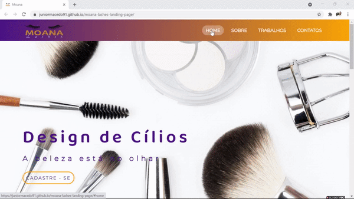

# 
Moana Lashes Landing Page

  

## About:
I made this website for a friend who works with Eyelash Extensions Application.

You can see all about her work and some techniques.

## Check out the website:
https://juniormacedo91.github.io/moana-lashes-landing-page/

Nesse site, busquei utilizar as seguintes técnicas:

 - [x] SEO - A great way of making application to get pages to rank;
 - [x] Flexbox - The best way of setting positions and develop responsive.
 - [x] Glassmorphism - Glass effect;
 - [x] Figma - An application to design layouts before coding;

## Skills:

